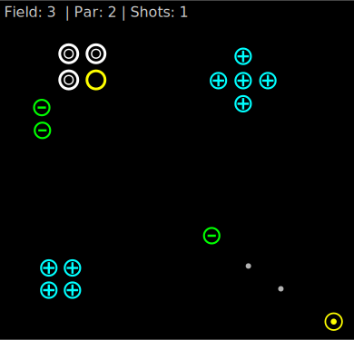

= Coulomb's Golf Game Design Document
:stem:

== Overview

=== Gameplay

Coulomb's Golf an electric twist on the classic game of golf.
Players must launch a charged particle to a goal location
navigating the many hazards of the field.
Hazards include stationary charges that push and pull charged particle
in accordance with Coulomb's law
as it makes its way through the field.
The player's score is based on the number of attempts taken to reach the goal;
the lower the score the better.

=== April 2022 C++ Best Practices Game Jam rules

This game is being created for the
https://github.com/cpp-best-practices/game_jam/tree/main/Jam1_April_2022[April 2022 C++ Best Practices Game Jam].
This contest has the following rules that must be followed:

Games must:

* use https://github.com/ArthurSonzogni/FTXUI[FTXUI]
* be created from the https://github.com/cpp-best-practices/ftxui_template[C++ Best Practices/ftxui_template project]
  via "use this template."
* compile with no warnings or errors on all pre-configured actions
* have selected a license
* run with no errors from Address Sanitizer or Undefined Behavior Sanitizer
  (as configured by default in "developer mode" of the provided template)
* interpret of the theme "round" in some way
* document any warnings that have been disabled, and why

Submission requirements:

* submissions will take place via a pull request to the
  https://github.com/cpp-best-practices/game_jam[ Best Practices Game Jam project]
* submissions must link to a specific github release of the project
* PR (and release) must be dated before the submission deadline of *April 11, 2022 5:00 AM PDT*

=== Interpretation of theme "round"

Coulomb's Golf fits in with the theme "round" in several ways:

* Electric particles are traditionally thought of as "round" and are rendered as such in the game.
* The paths taken by the charged particle on its way to the goal location form curved or "round" paths.
* A complete game of golf is also known as a "round" of golf.

=== Target audience

This game is suitable for all players.

// TODO: players who enjoy math and science will enjoy this game?

=== Target platforms

The game runs on Windows, macOS, and Linux
using the system's text based console.

=== Similar games

* https://sokpop.itch.io/n-body[n-body] - 2020 - Sokpop Collective
* https://store.steampowered.com/app/471160/Moonshot_Galaxy/[Moonshot Galaxy™] - 2016 - Liftoff Labs
* https://store.steampowered.com/app/1200300/Comet_Golf/[Comet Golf] - 2020 - Comet Golf Project Team

== Glossary

Coulomb's law:: Law of physics that describes the force experienced by charged particles.
Charged particle:: Replaces the role of the ball from the classic game of golf.
  It can move about the field in accordance with the laws of classical physics,
  including Coulomb's law.
Hazard:: An obstacle that gets in the particle's way on the way to the goal,
  increasing the challenge of the shot.
Field:: Area of play that contains hazards and the goal location.
Par:: predetermined number of shots to reach the goal location for a given field.
Supply chain attack:: A cyber-attacker compromises libraries or other
  dependencies of an application to attack systems that use the application.

== User interface

The game is rendered in a text based console.
The image below shows a concept drawing of the interface.

Positive and negative charges are denoted by plus (+) and minus (-) symbols
while neutral particles use an open symbol (o).
Each charge also as an associated color.
This lets users predict the behavior of the shot particle.

The goal location and shot location use unique symbols and colors.

As the charged particle moves through the field
it leaves a trail of small dots behind.
This lets users better see where the particle had been,
allowing them to adjust future shots.
To avoid cluttering the UI,
these dots disappear after a given number of movement steps
or when the user takes the next shot.

To take a shot,
the user clicks and drags the start location
pulling the particle back.
They release the mouse button to launch the particle,
giving it an initial velocity.

Some useful unicode characters include:
+ - ⨁ ⊕ ⊝ ⦾ ⊙ ✪ ★ ⊚ ⎊ 🟕 ② ⊖ 🟗 ⊜ ○ ● ◯ 🞇 🞄 🞊 ◌ · ⸳ (+) (-) (o) ( )

See https://unicode-table.com/en/ for additional characters.

== Additional details

=== Coulomb's law

The force between two charged particles is described by
https://en.wikipedia.org/wiki/Coulomb%27s_law[Coulomb's law]:

[stem]
++++
|F|=K\frac{|q_1q_2|}{r^2}
++++

Where stem:[q] is the charge, stem:[r] the distance between the particles,
and stem:[K] is a constant.

The force, stem:[F], can be described as:
[stem]
++++
F=ma
++++

Where stem:[m] is mass and stem:[a] is the acceleration.

Finally we can use the equations of movement to
solve for the particle's next position:

[stem]
++++
x = x_0 + vt + \frac{1}{2}at^2
++++

Where stem:[x] is the next position,
stem:[x_0] is the current position,
stem:[v] is the initial velocity,
and stem:[t] is the change in time.

This game does not take into account magnetism or quantum effects
of fast moving charged particles.

=== System and data security

Software security is an important consideration of any application, including games.

This game does not open network connections or load arbitrary data from disk,
thus it is at low risk of a direct attack.
It also does not use or store personal user data.

The biggest risk to the game is a supply chain attack
as this game uses several third party libraries.
To mitigate the risk,
only libraries provided by the getting started template are used.
